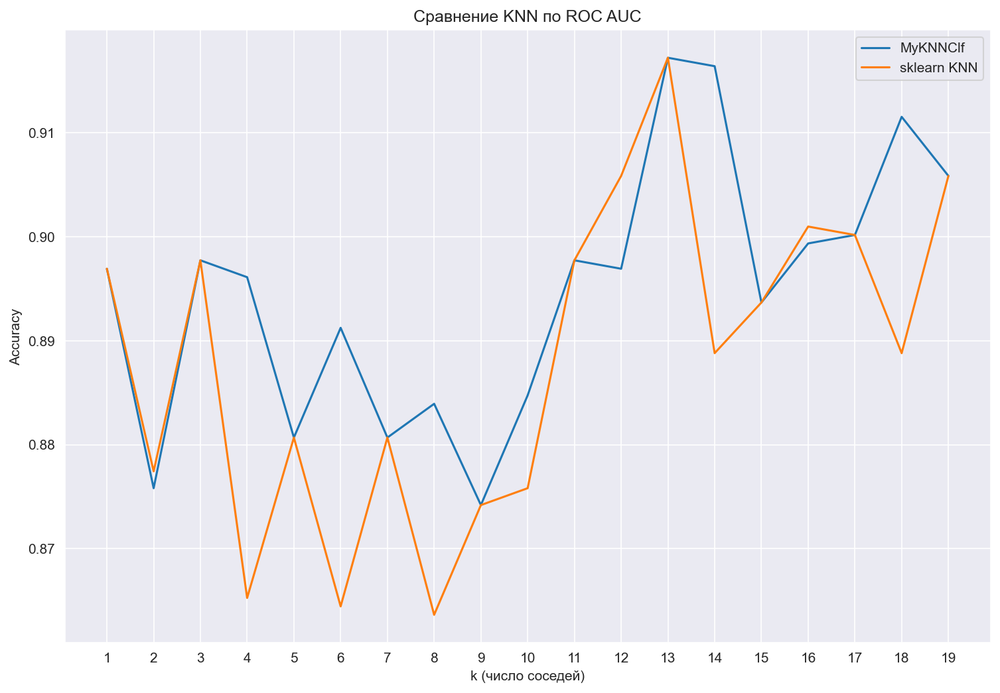
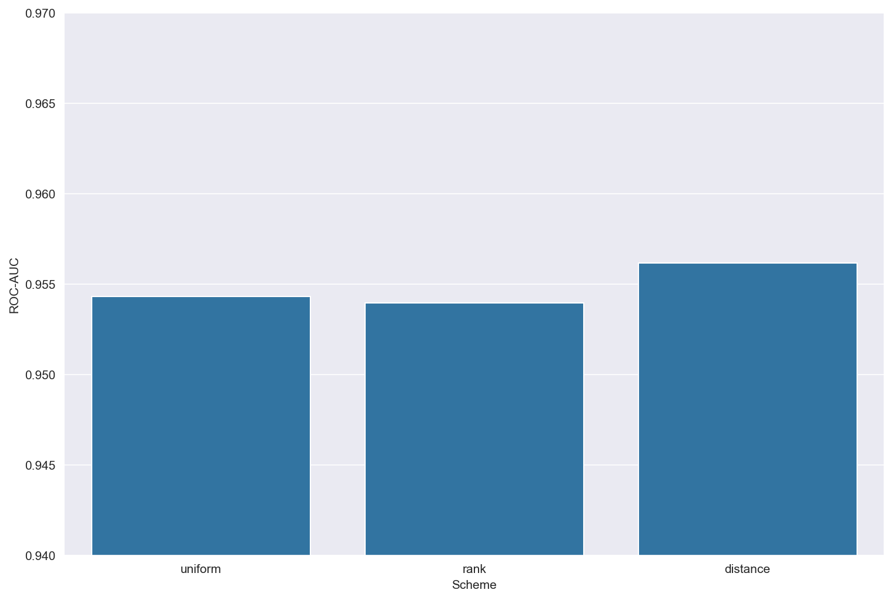
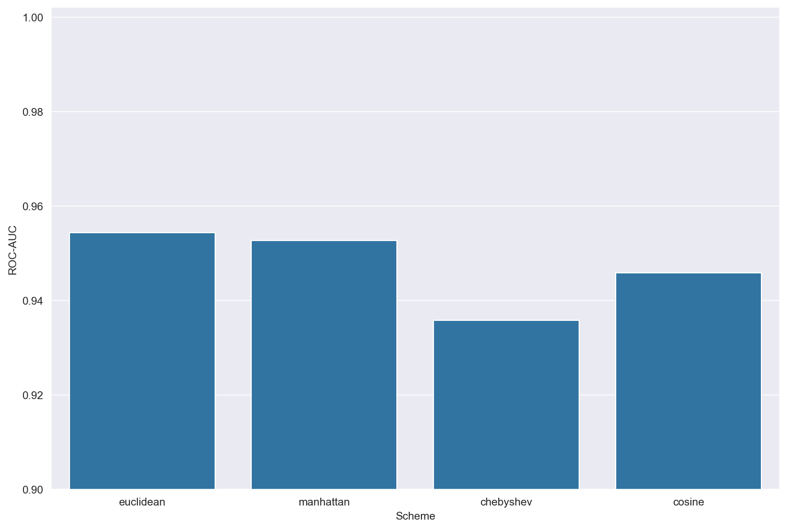

# Проект: Реализация KNN с нуля (MyKNNClf)

## Введение

Проект реализует алгоритм **k-ближайших соседей (k-Nearest Neighbors, KNN)** на Python без использования готовых библиотек машинного обучения.

Особенности реализации:

* Поддержка нескольких метрик расстояния: **евклидова, манхэттенская, Чебышева, косинусная**
* Разные схемы взвешивания соседей: **uniform, rank, distance**
* Использование **кучи (heapq)** для эффективного поиска ближайших соседей
* Возможность предсказания как классов (`predict`), так и вероятностей (`predict_proba`)
* Простая и наглядная структура кода для изучения работы алгоритма

**Цель проекта:** изучение принципов работы алгоритма KNN и его реализация с нуля.
**Актуальность:** KNN является одним из базовых алгоритмов машинного обучения, часто используемым как базовый классификатор и для обучения новичков.

---

## Теоретическая часть

### Модель KNN

Принцип работы алгоритма:

1. Для объекта \$x\$ находятся **k ближайших соседей** из обучающей выборки.
2. Решение о классе принимается **по большинству соседей** или с учётом весов.
3. Веса могут задаваться разными способами:

   * Равные веса (**uniform**)
   * Убывание по рангу (**rank**)
   * Обратная зависимость от расстояния (**distance**)

---

## Реализация (MyKNNClf)

Класс `MyKNNClf` поддерживает следующие параметры:

| Параметр | Тип | Описание                                                             |
| -------- | --- | -------------------------------------------------------------------- |
| k        | int | Количество ближайших соседей                                         |
| metric   | str | Метрика расстояния (`euclidean`, `manhattan`, `chebyshev`, `cosine`) |
| weight   | str | Схема взвешивания (`uniform`, `rank`, `distance`)                    |

---

## Подбор оптимального количества соседей
Исследование было проведено для встроенной и собственной реализации. При изменении количества соседей модели ведут себя одинаково

## Сравнение весовых схем

| Схема весов  | Принцип                                  | Особенности                                  |
| ------------ | ---------------------------------------- | -------------------------------------------- |
| **uniform**  | Все соседи равны                         | Подходит при однородных данных               |
| **rank**     | Вес обратно пропорционален номеру соседа | Ближайшие соседи важнее                      |
| **distance** | Вес обратно пропорционален расстоянию    | Хорошо работает при разных плотностях данных |

Исследование было проведено при количестве соседей k = 13. График построен по результатам работы собственной реализации

---

## Сравнение метрик расстояния

| Метрика       | Формула                                           | Применимость                                |
|---------------|--------------------------------------------------|---------------------------------------------|
| Евклидова     | $\sqrt{\sum_i (x_i - y_i)^2}$                   | Подходит для большинства задач              |
| Манхэттенская | $\sum_i \Vert x_i - y_i \Vert$                  | Устойчива к выбросам                        |
| Чебышева      | $\max_i \Vert x_i - y_i \Vert$                  | Учитывает только наибольшую разницу         |
| Косинусная    | $1 - \frac{x \cdot y}{\Vert x \Vert \cdot \Vert y \Vert}$ | Используется для текстов и высокоразмерных данных |

Исследование было проведено при количестве соседей k = 13. График построен по результатам работы собственной реализации

